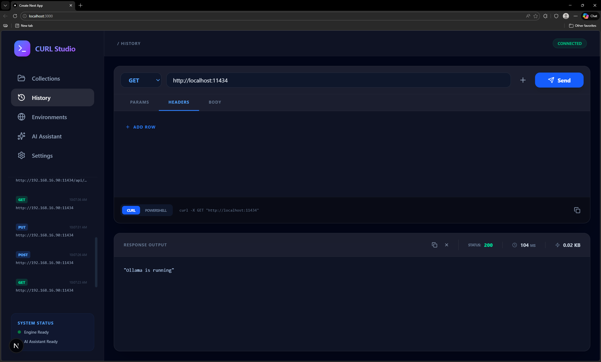
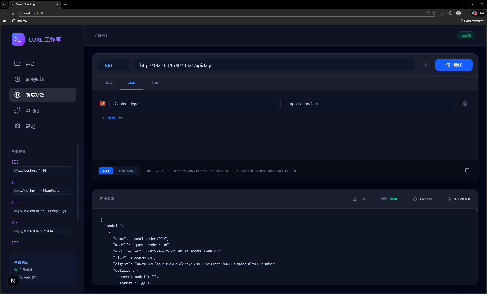
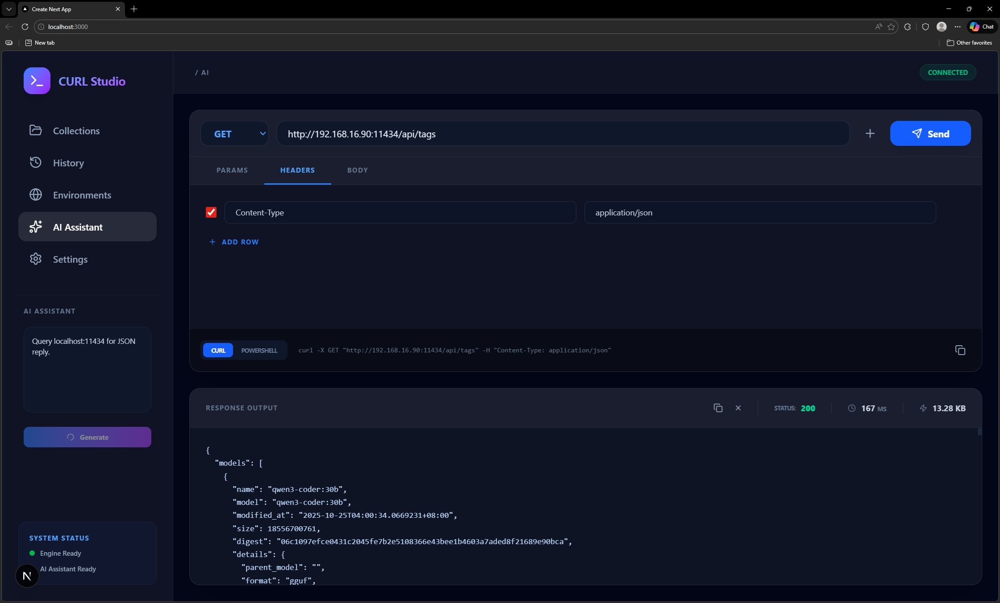

# 📖 CURL Studio User Manual

Welcome to CURL Studio! This manual will guide you through mastering this powerful API testing tool.

## 1. Interface Overview

- **Left Sidebar**: Toggle between Collections, History, Environments, AI Assistant, and Settings.
- **Top Toolbar**: Select HTTP Method (GET/POST...), input URL, and Send request.
- **Editor Area**: Configure Params, Headers, and Body.
- **Preview Box**: View real-time generated `curl` snippets.
- **Response Panel**: View status code, time, size, and formatted body.

## 2. Basic Operations
### Sending Your First Request
1. Select the `GET` method.
2. Enter `https://jsonplaceholder.typicode.com/posts/1` in the URL bar.
3. Click **Send** or press `Ctrl + Enter`.

### Saving to a Collection
1. Click the **+** icon to the right of the URL bar.
2. Enter a name for your request and select a target collection.
3. Click **Save**.

## 3. Using Environment Variables
You can use global variables to simplify your URLs and headers.

1. Go to the **Environments** tab.
2. Add a variable, e.g., `baseUrl` with value `https://api.example.com`.
3. Use `{{baseUrl}}/users` in the URL bar. The system will auto-resolve it upon execution.

## 4. AI Assistant
Let AI write requests for you:

1. Go to the **AI Assistant** tab.
2. Enter your requirement, e.g., "Create a POST request to /login with email and password in JSON body".
3. Click **Generate**.
4. The system will automatically populate the Method, URL, Headers, and Body.

## 5. Settings

- **Language**: Supports Traditional Chinese (zh-TW) and English (en).
- **Ollama Settings**: 
  - Enter your Ollama server IP.
  - The system will fetch available models (e.g., `llama3`, `qwen2.5-coder`).
  - Select a model to enable AI features.

## 6. System Status & Diagnostics
Check the sidebar footer for system health:
- **Engine Ready**: Using the system's native `curl` binary.
- **PROG-MODE**: No `curl` found; using native fetch fallback.
- **AI Server Status**: Indicates if the AI node is reachable.

---

## 💡 Pro Tips
- **Quick Search**: Use the search bar in History or Collections to filter endpoints instantly.
- **Response Download**: Use the download icon in the response panel to save results as `.json`.
- **Preview Toggle**: Switch between cURL and PowerShell syntax in the preview area for terminal use.
